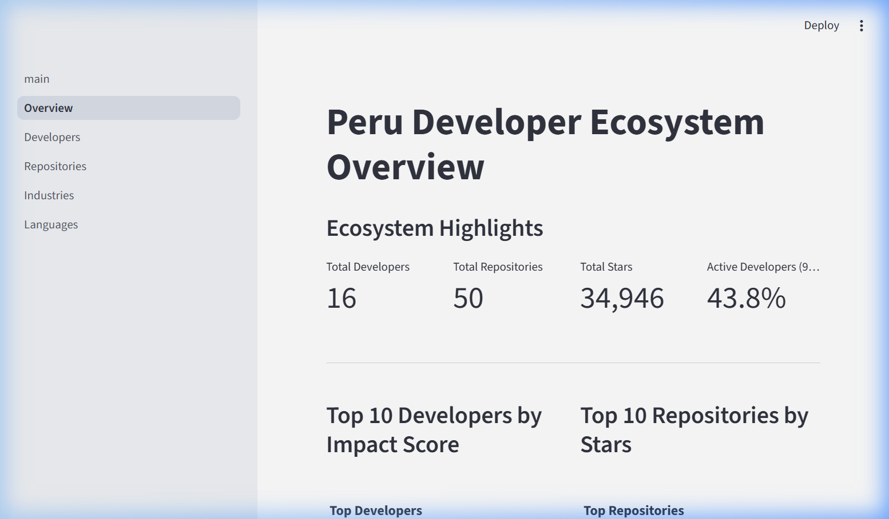
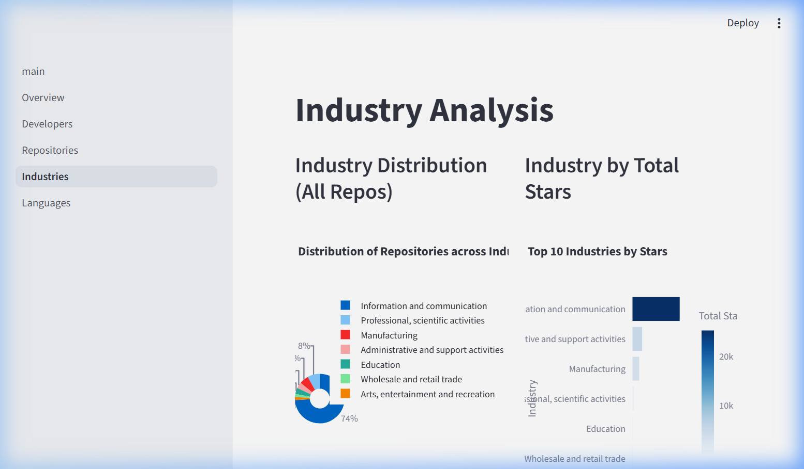

# GitHub Peru Analytics: A Deep Dive into the Developer Ecosystem

## Section 1: Project Title and Description
**Project Name:** GitHub Peru Analytics Dashboard

### Executive Summary
The **GitHub Peru Analytics** project is a comprehensive data engineering and business intelligence platform designed to map the digital footprint of software developers in Peru. By synthesizing raw data from the GitHub REST API and applying advanced AI-driven classification models, this project provides a multi-dimensional view of how Peruvian talent contributes to the global open-source community.

The platform doesn't just count repositories; it evaluates **impact, maturity, and industrial alignment**. It uses a sophisticated "Autonomous Classification Agent" powered by GPT-4o-mini to categorize projects within the 21 sectors of the International Standard Industrial Classification (ISIC/CIIU), bridging the gap between technical output and economic impact.



---

## Section 2: Key Findings & Ecosystem Insights

Our analysis of the Peruvian developer ecosystem, based on a curated sample of top-tier developers across 25 geographical locations (including all 24 departments of Peru and the Constitutional Province of Callao), reveals a robust and maturing community.

### 1. High Technical Global Impact
The analyzed sample has accumulated a total of **34,946 stars**. This is not merely a number; it represents a high "export value" of Peruvian logic. Repository "MGonto/restangular" and "remix-auth" by Sergio Xalambrí stand out as global pillars in the JavaScript/TypeScript ecosystem.

### 2. The Dominance of the Web Stack
The "Most Popular Languages" metric shows a heavy concentration in **TypeScript (26%)** and **JavaScript (24%)**. Combined, they represent half of the ecosystem's top output. This indicates that Peru's talent is highly optimized for Modern Web Development and SaaS (Software as a Service) platforms.

### 3. Industrial Diversification Beyond "IT"
While **74%** of repositories fall under **Information and Communication**, the AI agent identified significant technical activity in other sectors:
- **Professional & Scientific Activities (8%)**: Highly specialized tools like BibTeX search engines and GUI extensions for oscilloscopes.
- **Manufacturing (6%)**: A surprising trend in 3D printing firmware (Marlin, Ender3 configurations), showing a bridge between software and physical production.
- **Education (4%)**: Numerous high-quality tutorials for TensorFlow and Cybersecurity, positioning Peruvian developers as educators.

### 4. Seniority and Retention
The average account age of **11.7 years (4,264 days)** suggests a core group of "Early Adopters" who have remained active. With a **43.8% activity rate** (pushes in the last 90 days), the community displays a healthy balance between long-term maintenance and new innovation.



---

## Section 3: Data Collection Methodology

The data pipeline is built for resilience and accuracy through three main stages:

- **Stage 1: Geolocation Discovery**: A multi-threaded search across 25 specific location strings. We implement **Exponential Backoff** to respect the GitHub API limits (5,000 req/hr) and handle secondary rate limits gracefully.
- **Stage 2: Metric Enrichment**: For each discovered user, we calculate a custom **Impact Score**. This score weighs stars, forks, and followers to separate "Noise" from "Value".
- **Stage 3: Deep Extraction**: We don't just pull metadata; we pull **README contents (base64 decoded)** and full **Language Byte Distribution** to feed our AI reasoning engine.

---

## Section 4: Platform Features

The Streamlit dashboard is organized into five specialized modules:
1. **Overview Dashboard**: A high-level Looker-style view of the ecosystem's health.
2. **Developer Explorer**: A granular breakdown of individual "Power Users", sorted by their technical h-index.
3. **Repository Browser**: A deep-dive into the projects themselves, allowing filtering by stars, license, and primary language.
4. **Industry Analysis**: The jewel of the project—a visual representation of the AI-classified sectors, helping to understand where software is actually being applied.
5. **Language Analytics**: A correlation view between language popularity and project success (stars).

---

## Section 5: Installation & Setup

To deploy this platform in a local environment, follow these steps:

```bash
# 1. Clone the repository
git clone https://github.com/ValeryRL/users_peru_vale.git
cd github-peru-analytics

# 2. Virtual Environment Setup
python -m venv venv
source venv/bin/activate  # Or `venv\Scripts\activate` on Windows

# 3. Dependencies
pip install -r requirements.txt

# 4. Configuration
# Create a .env file with:
# GITHUB_TOKEN=your_pat_here
# OPENAI_API_KEY=your_key_here
```

---

## Section 6: Pipeline Execution Flow

The analysis is performed through a specific script sequence:

1. **`python scripts/extract_data.py`**: Fetches users and repositories.
2. **`python scripts/classify_repos.py`**: Triggers the AI Agent to process descriptions and READMEs.
3. **`python scripts/calculate_metrics.py`**: Computes the H-Index, Impact Score, and Ecosystem averages.
4. **`streamlit run app/main.py`**: Launches the interactive UI.

---

## Section 7: Metrics Documentation

### Technical Impact Metrics
- **Impact Score**: `Stars + (Forks * 2) + Followers`. This formula prioritizes "Forkability" (utility) over simple popularity.
- **h-index**: Adapted from academic citations. A developer with h-index 5 has at least 5 repositories with at least 5 stars each.
- **Language Diversity**: The count of unique languages used across a developer's portfolio.

### Activity Metrics
- **Repos per Year**: Normalizes output based on account seniority.
- **Follower Ratio**: `Followers / Following`. Indicates whether a developer is a "Consumer" or a "Thought Leader" (Source of Influence).

---

## Section 8: AI Agent Architecture

### The "Reasoning" Loop
The project employs an **Autonomous AI Agent** instead of a simple prompt. This agent uses the **ReAct (Reasoning + Acting)** pattern:

1. **Input**: A repository name and description (e.g., "Marlin").
2. **Reasoning**: "The description is technical. I need to know the specific utility. I will fetch the README."
3. **Action**: Calls `get_readme()`.
4. **Observation**: README mentions "3D Printer firmware for additive manufacturing."
5. **Final Decision**: Classifies as **Sector C (Manufacturing)** with **High Confidence**.

This approach ensures that even "empty" descriptions are classified accurately by looking at the actual documentation and code composition.

---

## Section 9: Strategic Limitations

Every data project has boundaries. Our current limitations include:
1. **Geographic Filtering**: We are limited by users who **explicitly** state their location in their profile. This under-represents nomadic developers or those with private locations.
2. **Sampling Bias**: To maintain API stability, we prioritize "Top Contributors". This provides a view of the *elite* ecosystem rather than the *total* volume.
3. **Language Context**: Classification is optimized for English/Spanish READMEs. Multi-language or binary-only repos may result in lower confidence scores.

---

## Section 10: Authors & Institutional Information

- **Primary Developer**: PC (Student/Researcher)
- **Project Context**: Master's/Advanced Developer Ecosystem Analysis
- **Submission Date**: March 15, 2026
- **License**: MIT - Open for academic use.

---
**[Easter Egg - Antigravity]**
*This project was developed with the assistance of Antigravity AI, ensuring code flight and high-altitude insights.*
